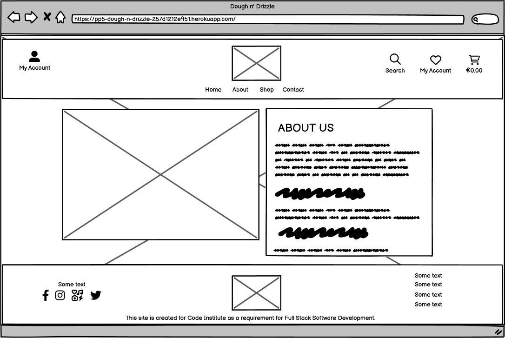

# Dough n Drizzle

AM I RESPONSIVE PHOTO HERE

**Table of Contents**

-   Project Introduction
    -   [Dough n Drizzle](#dough-n-drizzle)
    -   [Link to Live Project](#link-to-live-project)
    -   [Objective](#objective)
-   [UX/UI Design](#uxui-design)
    -   [The Strategy Plane](#the-strategy-plane)
    -   [The Scope Plane](#the-scope-plane)
    -   [The Skeleton Plane](#the-skeleton-plane)
    -   [The Structure Plane](#the-structure-plane)
    -   [The Surface Plane](#the-surface-plane)
-   [Features](#features)
-   [Future Enhancements](#future-enhancements)
-   [Testing](#testing)
-   [Agile Development](#agile-development)
-   [Bugs and Issue](#bugs-and-issues)
-   [Technologies and Languages used](#technologies-and-language)
-   [Developement](#development)
-   [Deployment](#deployment)
-   [Credits](#credits)
-   [Acknowledgements](#acknowledgements)

# PROJECT INTRODUCTION

Dough n' Drizzle is a comprehensive e-commerce web application designed for selling artisanal baked goods and confectionery products. Built using the Django framework, the project offers a streamlined user experience, allowing customers to browse and purchase items online with ease. The website supports essential e-commerce features such as product listings, shopping cart functionality, order management, secure payment processing via Stripe, and user authentication through social accounts.

The project follows best practices for web development, incorporating features such as form handling with Django Crispy Forms, media management through AWS S3 via django-storages, and secure deployment with Gunicorn and PostgreSQL. It's a robust, scalable, and user-friendly platform that serves both customers and administrators efficiently.

Key Features

-   Product Listings: A clean and responsive interface for browsing baked goods with detailed product pages.
-   Shopping Cart: Users can add and manage products in their cart, modify quantities, and proceed to checkout.
-   Wishlist: Allows users to save their favorite items for future purchases.
-   Stripe Integration: Secure payment processing with Stripe API for handling transactions.
-   User Authentication: Django Allauth enables social login functionality (e.g., Facebook, Google) and regular account management.
-   Responsive Design: The front end is fully responsive, ensuring a smooth experience on both desktop and mobile devices.
-   Admin Control: Superusers can manage product listings, categories, and view order details via Django's admin interface.
-   Media Management: AWS S3 is used to handle static and media files, ensuring scalability and performance.

## [Link to Live project](https://pp5-dough-n-drizzle-257d1212e951.herokuapp.com/)

## Objective

The primary objective of Dough N Drizzle is to create an intuitive and efficient online platform for selling artisanal baked goods and confectionery products. The project aims to deliver a seamless shopping experience for customers while providing store owners with the tools to manage product listings, orders, and user interactions effectively. By leveraging modern technologies like Django, AWS S3, and Stripe for secure payments, the platform focuses on scalability, security, and performance, ensuring it meets the needs of both small businesses and their growing customer base.

# UX/UI Design

## The Strategy Plane

### VISION

To create a delightful and seamless online experience for our customers, where they can easily explore, order, and enjoy our delicious baked goods and desserts while feeling valued and engaged throughout their journey.

### OBJECTIVES

-   **Responsive Design**: Ensure that the website is fully responsive, providing a consistent and enjoyable experience across all devices (desktop, tablet, and mobile).
-   **Facilitate Easy Navigation**: Create an intuitive navigation structure that allows users to find products quickly and easily, aiming for a minimum of 80% user satisfaction in usability tests.
-   

### USER NEEDS

-   **Easy Browsing and Searching**: Users need a streamlined experience to find products, with clear categories, filters, and search functionality to locate specific items quickly.
-   **Detailed Product Information**: Customers require comprehensive information about products, including ingredients, allergens, nutritional facts, and high-quality images to make informed purchasing decisions.
-   **Secure and Simple Checkout Process**: Users need a hassle-free checkout experience with multiple payment options, easy editing of cart items, and clear instructions to complete their orders securely
-   **Mobile Optimization**: Users expect a fully functional mobile experience, as many customers will shop via smartphones and tablets.
-   **Customer Support Access**: Users need easy access to customer service through multiple channels (email, phone) for inquiries or issues regarding orders.

### IMPLEMENTATION STEPS

-   **Wireframing**: Create wireframes for key pages, focusing on layout, navigation, and user interaction.
-   **UI** **Design**: Develop a visually appealing UI that reflects the brand identity of Dough n Drizzle, incorporating elements such as colors, typography, and imagery that resonate with the target audience.

## The Scope Plane

### FEATURES:

-   **Core Features**
    -   **User Account Management**
        -   **User Registration and Login:** Users can create accounts and log in securely.
        -   **Profile Management:** Users can view and update their personal information, including saved addresses and payment methods
    -   **Product Management**
        -   **Product Listings:** Users can browse through a categorized list of products.
        -   **Product Details**: Each product will have a dedicated page with images, descriptions, prices, and reviews.
        -   **Search and Filter Options: Users** can search for products and apply filters (e.g., category, price range).
    -   **Shopping Cart Functionality**
        -   **Add to Cart**: Users can add items to their shopping cart from product listings and detail pages.
        -   **Cart Overview:** Users can view the items in their cart, adjust quantities, and remove items.
    -   **Checkout process**
        -   **Order Form:** A comprehensive form capturing user details (name, address, payment information).
-   **Design Features**
    -   **Responsive Design**
        -   **Mobile-Friendly Interface**: Ensuring that the site is accessible and functional on all devices (desktops, tablets, and smartphones).
    -   **User-Friendly Navigation**
        -   **Clear Menu Structure**: Easy-to-follow navigation with categorized products and intuitive links.
    -   **Visual Design**
        -   **Branding Consistency:** Use of colors, typography, and images that reflect the Dough n Drizzle brand.
        -   **High-Quality Imagery**: Professional images of products to enhance visual appeal.
-   **Technical Features**
    -   **Integration Capabilities:** Payment Gateway Integration: Seamless integration with payment processors like Stripe

### CUSTOM FEATURES:

-   **Subscription** - This allow users to sign up to receive emails about news, offers,
-   **Admin** **Dashboard**
    -   **Product Management:** add, delete and update products.
    -   **Discount Management:** add, delete and update discounts.
    -   **Orders Management:** update status and view all orders

### CONTENT REQUIREMENTS:

-   **Home Page Content:**
    -   **Landing Page:** Hero Image and shortcut button links
    -   **Login/Register:** Links to register or login
    -   **Main Navbar:**  view about, contact us, and products
    -   **Search:** Search functionality
    -   **Call-to-Action (CTA)**: Encouragements to explore products or sign up for newsletters
-   **Login Page Content:**
    -   Login form with fields for email and password
    -   Link to the registration page
-   **Register Page Content:**
    -   Registration form with fields for email, username, and password
-   **About Us Page**
    -   Brief introduction about the business, it’s mission and link to contact page
-   **Products**
    -   **Product Titles**: Clear and descriptive names for each product.
    -   **Detailed Descriptions**: Information about ingredients, flavor profiles, and unique selling points.
    -   **Pricing Information:** Clearly displayed pricing for each product**.**
-   **Links to Social Medias**
-   **Technical Contents**
    -   **Privacy Policy**
    -   **FAQ Page**
        -   *Common Questions*: Answers to frequently asked questions about products, shipping, returns, and customer service.
        -   *Clear Solutions*: Direct and informative responses that help alleviate customer concerns.
    -   **Contact Information**
    -   **Terms of Service**
-   **Call To Action (CTA)**
    -   **Sign-Up Prompts**: Invitations to join the mailing list for discounts and updates.
    -   **Social Media Follow Links**: Encouragements to follow Dough n Drizzle on various platforms.
-   **SEO Content Requirements**
    -   **Keywords and Phrases: Research and identify keywords relevant to Dough n Drizzle that should be integrated into website content.**
    -   **Meta Descriptions: Create engaging and descriptive meta tags for each page to improve search engine visibility.**
    -   **Alt Text for Images: Provide descriptive text for all images to enhance accessibility and SEO.**

### USER STORSER STORIES
Dough n Drizzle project uses a Kanban Board to manage and track progress throughout the development cycle. The Kanban board visualizes work stages, from initial backlog through to completed tasks, facilitating efficient task management and smooth workflow. This approach allows me to prioritize tasks, track progress, and ensure that all features and improvements are delivered in a timely manner.

-   **MoSCoW Prioritization**
	- Must Have:
		- As a User:

			- I want to register for an account so that I can access the platform's features.
			- I want to log in to my account so that I can view my profile and order history.
			- I want to add products to my cart so that I can purchase them later.
			- I want to make a payment using Stripe so that I can complete my order.
			- I want to create a wishlist so that I can save products for future reference.
			- I want to filter products by category, price, and ratings to find items that meet my preferences.
		- As an Admin:
			- I want to manage user accounts so that I can assist users with their issues.
			- I want to view all orders so that I can process and manage them effectively.
			- I want to add and update product information so that the catalog remains current.
	- Should Have:
		- As a User:
			- I want to receive email notifications for order confirmations so that I have a record of my purchases.
			- I want to view all products available on the platform so that I can make informed purchasing decisions.
			- I want to update my account information so that my profile is always up to date.
		- As an Admin:

			- I want to generate reports on sales and user activity so that I can make informed business decisions.
			- I want to manage product inventory levels so that we can prevent stockouts.
	- Could Have:
		- As a User:

			
			- I want to read product reviews and ratings from other users to guide my purchase decisions.
		- As an Admin:

			- I want to implement a promotional discount feature to attract more customers.
			- I want to manage user feedback and suggestions for platform improvement.
	- 	Won't Have:
		- As a User:

			- I won’t need social media integration for sharing products on external platforms.
			- I won’t require a mobile application at this time.
		- As an Admin:

			- I won’t need to handle third-party logistics directly.
			- I won’t be managing international shipping at this stage.

## The Skeleton Plane

### LAYOUT AND WIREFRAME STRUCTURE

-   **Home Page:**
	
-   **About:**
	
-   **Shop**
	
-	**Contact:**
	
-	**Admin:**
	
-	**Wishlist:**
	

**Mobile and Tablet Wireframes:**
	

### ENTITY RELATIONSHIP MODEL
**Relationships**
- A User can have multiple Orders (One-to-Many).
- An Order can have multiple OrderItems (One-to-Many).
- A Product can belong to one Category (Many-to-One).
- A Category can have multiple Products (One-to-Many).
- An Order is associated with one Payment (One-to-One).
- An Admin manages the platform and can manage multiple Products and - Orders (One-to-Many).

ERD Diagram

**Explanation**
- User: Represents customers of the e-commerce platform, storing personal and account-related information.
- Product: Represents items available for purchase, linked to categories for better organization.
- Category: Used to group products, making it easier for users to navigate the catalog.
- Order: Represents a user's purchase transaction, linked to multiple order items.
- OrderItem: Contains details about each product within a specific order, including quantity and price.
- Payment: Represents the transaction details for each order, confirming payment processing.
- Admin: Represents administrative users who manage the system, products, and orders.

### SEO STRAGETIES

SEO strategies for Dough n Drizzle to improve its search visibility and attract more organic traffic:

1.  **Optimize Website for Search Engines**
    -   **Title Tags & Meta Descriptions:** Ensure that the base template has unique, keyword-rich title tags and meta descriptions. For example:
        -   **Title:** "Custom Cakes & Artisan Desserts - Dough n Drizzle"
        -   **Meta:** "Order custom cakes, pastries, and gourmet cookies. Dough n Drizzle offers delivery and pick-up options for fresh, handcrafted desserts."
            -   **Key SEO Additions:**
                1.  **Meta Title & Description:** Relevant to the Dough n' Drizzle business, targeting keywords like custom cakes, cookies, and desserts.
                2.  **Keywords:** Keywords relevant to the bakery business like "custom cakes," "cake delivery," "artisan desserts," and "online bakery."
                3.  **Open Graph & Twitter Meta Tags**: Optimizes the website for sharing on social media platforms like Facebook, ensuring that when someone shares the site, it shows a title, description, and an image.
    -   **Headings (H1, H2, H3):** Use primary keywords in H1 and secondary keywords in H2/H3 tags. Structure the content clearly for users and search engines.
2.  **Keyword Research & Optimization**
    -   **Target Primary & Long-Tail Keywords**: Identify relevant keywords for custom cakes, delivery options, and other baked goods. For example:
        -   Primary: "Custom cakes," "Cake delivery," "Gourmet cookies"
        -   Long-tail: "Best custom birthday cakes near me," "Online bakery for weddings"
    -   **Integrate Keywords Naturally**: Place keywords in key areas (page titles, product descriptions, URLs, headings, alt tags for images) without overstuffing.
3.  **Content Marketing**
    -   Create detailed FAQs addressing customer needs. This will also rank for long-tail queries like “What products do you offer?”
4.  **Mobile Optimization**
    -   **Mobile-Friendly Design**: Ensure the website is fully responsive on mobile devices. Since many users may order via mobile, optimize loading times and usability.
    -   **Page Speed Optimization**: Compress images, leverage browser caching, and use content delivery networks (CDNs) to improve website speed.
5.  **On-Page SEO for Product Pages**
    -   **Product Descriptions**: Write unique, descriptive content for each product, incorporating primary keywords and long-tail variations. Focus on the benefits and features of the cakes or desserts.
    -   **Alt:** all images have alt attribut
    -   **Schema Markup**: Implement schema for products and reviews to enhance rich snippets in search results (e.g., category, product prices).
6.  **E-Commerce SEO**
    -   **Optimized URLs**: Use clean, descriptive URLs (e.g., “/signature-cakes/” instead of “/product1234”).

### WEB MARKETING STRATEGIES
-   **Leverage Social Media Platforms**
    -   **Facebook:** a dummy facebook page is created for this website. Visit [FACEBOOK PAGE](https://www.facebook.com/doughndrizzle) here
		- **Desktop Screenshots**

		- **Mobile Screenshots**

-   **Online Presence**
    -   **Website Optimization:** website is user-friendly, mobile-optimized, fast-loading, and visually appealing. This is especially crucial for e-commerce if you're selling your products online

## The Structure Plane

### INFORMATION ARCHITECTURE

-   **Global Navigation:**

	- **Home**

		Overview of the bakery, latest offers, and featured products

	- **Shop**

		Categories: Browse products by categories (e.g., Cakes, Pastries, Cookies, etc.).

		All Products: View all available products.

		Special Offers: View discounts and promotions.
	
	- **Cart**

		View Cart: See all items added to the cart with options to update quantity or remove.
		
		Checkout: Proceed to enter shipping and payment information.

	- **My Account**

		Register/Sign Up: Create a new account.

		Login: Access your account.

		Order History: View past orders and their statuses.

		Account Details: Update personal information, addresses, and password.

		Logout: Sign out of the account.
	- **About Us**

		Our Story: Learn about Dough n Drizzle's mission and background.

		Meet the Team: A brief introduction to the team behind the bakery.

		Contact Us: Contact information, including address, phone, email, and a contact form.

	- **FAQ**

		Common questions and answers about orders, products, and policies.
	
	- **Policies**

		Term of Service

		Privacy Policy: How customer information is collected and used.
- **Footer Navigation (Quick Links)** Social Media Links: Facebook, Instagram, e

### INTERFACE ELEMENTS:

-   **Forms:**
    -   **User Registration Form:** Input validation for email, username, password and password confirmation fields
    -   **Login Form:** Input validation for email and password fields
    -   **Ticket Form:** Input validation for subject and description fields and status (hidden field or dropdown for tech support).
    -   **Comment Form:** Input validation for comment text
-   **Buttons:**
    -   **Primary** buttons for actions like "Register", "Log In", "Logout", "Create Ticket", "Submit", "Edit", "Delete", "Next", "Last", "First", and "Previous".
    -   **Secondary** buttons for action like "Cancel", "Close", and "Save Changes".
-   **Tables:**
    -   **Ticket List:** Columns for Ticket ID, Status, Subject, Created On (date only), and User. Clickable rows to view ticket details, pagination.
    -   **Ticket List for Mobile:** Columns for Ticket ID and Status.
-   **Modals:**
    -   For editing comments to avoid navigating away from the ticket detail page. Opens when the "Edit" button is clicked on a comment, contains the comment text pre-filled, and has a save button to update the comment
    -   For deleting ticket and comments.
-   **Alerts:**
    -   For success and error messages, displayed using Bootstrap alerts for actions like creating tickets, adding comments, updating tickets, etc..
    -   For Access Denied and 404 Error using a customised page.

### INTERACTION DESIGN:

-   **Ticket Creation:**
    -   User fills out the ticket form and submits.
    -   System validates input and creates a ticket.
    -   Success message is shown.
    -   System will display newly created ticket with an option to edit/delete.
-   **Editing Ticket:**
    -   User clicks "Edit" on a ticket
    -   Redirect to a page to update ticket with the text pre-filled.
    -   User updates the ticket with the option to update status if admin/staff and then save changes
    -   System validates and updates the ticket.
    -   Success message is shown, and the updated ticket is displayed.
-   **Commenting:**
    -   User adds a comment via the form.
    -   System validates input and adds the comment.
    -   Comment appears below the ticket details with an option to edit/delete (if allowed).
-   **Editing Comments:**
    -   User clicks "Edit" on a comment.
    -   Modal opens with the comment text pre-filled.
    -   User updates the comment and saves changes.
    -   System validates and updates the comment.
    -   Success message is shown, and the updated comment is displayed.

## The Surface Plane

### COLOUR SCHEME

-   **Primary Colors:**
    -   \#FFFFFF (White):
        -   Use: Backgrounds, text contrast, and elements requiring emphasis.
        -   Example: Used for text and modal backgrounds to ensure readability.
    -   \#000000 (Black):
        -   Use: Text, icons, and elements requiring high contrast.
        -   Example: Navigation links and footer text.
    -   \#E47784 (Soft Pink):
        -   Use: Accents, buttons, and hover effects.
        -   Example: Use in buttons or highlight elements for calls to action.
    -   \#65B6C0 (Turquoise):
        -   Use: Primary buttons, backgrounds for sections, and active elements.
        -   Example: Button backgrounds and header backgrounds.
    -   \#E448FE (Vibrant Pink):
        -   Use: Important highlights or error messages.
        -   Example: Error notifications or alerts.
    -   \#80AEFF (Light Blue):
        -   Use: Hover states and secondary buttons.
        -   Example: Use for button hover effects or borders.
    -   \#FFB6BD (Light Pink):
        -   Use: Backgrounds and subtle highlights.
        -   Example: Background for card components or section dividers.
    -   \#FFBD6F (Soft Yellow):
        -   Use: Highlights and subtle attention grabbers.
        -   Example: Notification badges or as part of a gradient.
    -   \#25356D (Deep Blue):
        -   Use: Text headers, backgrounds, and navigation elements.
        -   Example: Used in the footer and headings.
-   **Alerts and Modals:**
    -   Alerts:
        -   Background Color: Varies based on message type (e.g., success, danger)
        -   Text Color: White
    -   Modals:
        -   Text Color: White
        -   Body Background: \#ffffff (white)

### TYPOGRAPHY

-   **Playpen Sans -** a modern sans-serif typeface available through Google Fonts.
I used this 

### IMAGES

-   **Background** found in [Freepik](https://www.freepik.com/)
-   **Logo –** Designed and created my own logo for uniqueness
-   **Products** – Sourced from different baking sites and added border for consistency. Linkes of images can be found [HERE](documentation/readme-md/image-links.pdf)

# FUTURE ENHANCEMENTS

## FEATURES

-   **Shopping Cart:**
    -   **Discount Code Application**: Users can enter discount codes and see updated totals.
-   **Checkout Process:**
    -   **Multiple Payment Options:** Support for various payment methods (credit/debit cards, digital wallets).
-   **User Feedback Mechanisms**
    -   **Product Reviews**: Users can leave reviews and ratings for products.
    -   **Customer Support Contact**: A support form or chat feature for user inquiries.

## SEO

-   **Content Marketing**
    -   **Blog**: Regularly update the blog with relevant, engaging content such as cake design trends, how to choose wedding cakes, cake care tips, or seasonal dessert ideas. Include targeted keywords and long-tail search queries.
        -   Example blog posts:
            -   "Top 5 Wedding Cake Trends for 2024"
            -   "How to Store and Serve Your Custom Cakes"
-   **Local SEO Optimization**
    -   **Google My Business (GMB)**: Create or optimize your GMB listing. Ensure that the business name, address, phone number, and hours are accurate. Include high-quality images of your bakery and products.
    -   **Local Keywords**: Focus on local keywords like “Best custom cakes near [City Name]” or “Artisan bakery in [City Name].”
    -   **Local Listings & Reviews**: Encourage satisfied customers to leave reviews on Google and Yelp. Positive reviews improve trust and local rankings.
-   **Backlink Building**
    -   **Collaborate with Local Influencers**: Partner with local food bloggers or event planners to generate backlinks and social mentions.
    -   **Guest Blogging**: Write guest posts for local publications or industry websites to build credibility and backlinks to your site.
    -   **Submit to Local Directories**: Ensure your business is listed on relevant directories (Yelp, TripAdvisor, etc.) with accurate information.
-   **E-Commerce SEO**
    -   **Internal Linking**: Strategically link to relevant product pages, blog posts, and categories to keep users on your site longer and help search engines crawl your content.
    -   **Breadcrumb Navigation**: Implement breadcrumb navigation to improve user experience and help search engines understand your site’s structure.
-   **Monitor and Improve**
    -   **Analytics & SEO Tools**: Regularly monitor performance using Google Analytics, Google Search Console, and tools like Ahrefs or SEMrush to track keyword rankings, site traffic, and user behavior.
    -   **Improve Based on Data**: Continuously optimize content based on the insights from these tools. Track which pages are performing well and refine those that are underperforming.
-   **External Links**
    -   Calendar of upcoming wedding/party fairs that will be attending
    -   Tips & Advice for baking

## WEB MARKETING

1.  **Build Strong Online Present**
    -   **Blogging**: Regular blog posts related to baking, dessert trends, recipes, and health tips can help boost your website’s ranking on search engines. Include internal links to your products or services, and share these blogs across your social media platforms.
2.  **Leverage Social Media Platforms**
    -   **Instagram**: Visual platforms like Instagram are ideal for food businesses. Post high-quality photos and videos of your products, behind-the-scenes content, special offers, and customer testimonials. Use relevant hashtags like \#DoughnDrizzle, \#GourmetDoughnuts, and \#ArtisanDesserts to reach a broader audience.
    -   **Facebook**: Run Facebook ads targeting local customers, highlighting promotions, special offers, and new product launches. You can also create an event for a new product release or special seasonal offerings.
    -   **TikTok**: This platform is great for creating engaging, viral content. You could create short, entertaining videos showing unique ways you make your products, time-lapse recipes, or customer reactions.
    -   **Pinterest**: Many users look for food ideas and recipes on Pinterest. Post appealing images of your desserts and link them to your website or blog.
3.  **Use Email Marketing**
    -   **Build a Mailing List**: Encourage visitors to sign up for your newsletter by offering a small incentive, such as a discount on their first order or exclusive access to new product launches.
    -   **Weekly/Monthly Newsletters**: Send out newsletters with updates on new products, special discounts, seasonal offerings, and baking tips. Keep the content engaging and include visuals of your most popular items.
    -   **Targeted Campaigns**: Segment your email lists to run more personalized campaigns, such as birthday discounts, "we miss you" promotions for inactive customers, or exclusive pre-sales for your loyal customers.
4.  **Offer Online Promotions & Deals**
    -   **Limited-Time Offers:** Create a sense of urgency with flash sales, holiday specials, or limited-time discounts on select products. Promote these offers through social media, your website, and email.
    -   **Referral Program**: Set up a referral program that rewards customers for referring their friends to your business. You can offer discounts, free items, or loyalty points.
    -   **Loyalty Program**: Offer a points-based loyalty program where customers can earn points with every purchase, which can be redeemed for discounts or free items.

# TESTING

-   Complete Testing documentation can be found [HERE](TESTING.md)

# AGILE DEVELOPMENT

# BUGS AND ISSUES

## AM I Responsive website not responding on the day of testing
    I created a a photo on how it looks on mobile, tablet and desktop screen sizes. 

## Increment/Decrement Button on product detail page

**Issue:** The +/- buttons on the quantity section is meant to update the quantity on this page, however when during the early stages these buttons are directly updating the cart page. You can see the update when the button was clicked the value on the cart increases. Both buttons increases the value of the cart.

**Resolution:** Issue was resolved when the css eventually load by pressing hard refresh several times.

## Problem after upgrading to django 5.0 "AttributeError: 'BlankChoiceIterator' object has no attribute "'len'"

**Issue:** This error comes up after I install django-countries==7.2.1. I accidentally upgraded to Django 5.0.

**Remedies:**

**Resolution:** I uninstall django-countries 7.2.1 and installed django-countries 7.6.1. This has the fix for this bug. You can reference on this [Github](https://github.com/SmileyChris/django-countries/issues/447) repo about Django Countries

## Django not connecting/uploading static files to AWS S3 Bucket.

**Issue:** After adding all the required configuration settings for AWS and deploying to Heroku, static filea re not uploading to my AWS S3 Bucket.

**Remedies:**

1.  I refactored AWS settings several times, disable and re-enable static_root folder.
    1.  I created another AWS S3 bucket incase I missed a step when following the walkthrough. Another student provided an updated instruction
    2.  

**Resolution:** I downgraded my Django version from 5.1.1 to Djano version 4.2. After pushing to Heroku, all my static files uploaded to my AWS S3 Bucket. Issue was fixed by Roman from Code Institute

## Heroku throws a server error 500

**Issue:** Deployed project throws a server error 500 when trying to access newsletter subscription in admin and after entering an email to test newsletter subscription functionality but works fine workspace

**Resolution:** Despite running database migrations in workspace, migrations have to be applied in heroku by running:

1.  Login to Heroku from workspace
2.  Run:

        heroku run python3 manage.py migrate

# TECHNOLOGIES AND LANGUAGE

-   Backend: Django 4.2 (Python web framework)
-   Frontend: HTML5, CSS3, Bootstrap 4
-   Database: PostgreSQL
-   Payment Gateway: Stripe API
-   Authentication: Django Allauth
-   Storage: AWS S3 and PostgreSQL for static and media file handling
-   Deployment: Gunicorn (WSGI HTTP Server), Boto3 for AWS S3
-   Hosting: The app can be deployed on platforms like Heroku or AWS EC2.

Version Control

-   **GitHub:** For hosting the code repository and facilitating collaboration.

## Deployment

-   \***Heroku:** For deploying the web application in a scalable and reliable manner.
-   **Gunicorn:** A Python WSGI HTTP Server for running the application on Heroku.

## Additional Tools and Libraries

-   **Crispy Forms:** For enhancing the rendering of Django forms.
-   **Flaticons:** For scalable vector icons.

# DEVELOPMENT

This application was develop in Code Institute Gitpod, hosted in GitHub and deployed in Heroku.

# DEPLOYMENT

The site was deployed via Heroku.

## Project Deployment

To deploy the project through Heroku:

-   Login to Heroku
-   Create a new Heroku application by going to the Dashboard and select New and Create New App
-   Give your app a name (pp4-techtackles-by-hc) and choose the region nearest to you (Europe). This will create an app in Heroku and will redirect you to the Deploy tab.
-   On the Deploy tab, connect your Github and search for your repository.
-   Manually deploy the main branch of this GitHub repo.
-   On the Resources tab, ensure eco-dyno is enabled and delete any Postgres database Add-on.
-   Add the KEY - DISABLE_COLLECTSTATIC with the Value - 1 to the config vars, this must be removed before final deployment.
-   Add the database to the app by going to Settings tab, under Config vars add the following: Key= Database_URL Value = your postgres url
-   In your Django app, make sure you install gunicorn\~=20.1 and freeze it to the requirements.txt file.
-   Create a new file env.py on the root directory and import the os library and set the environment variable for the DATABASE_URL the same as your settings in Heroku.
-   Add SECRET_KEY using the os.environ in the env.py and add the same SECRET_KEY on the settings tab in Heroku under Config vars
-   In the settings.py file within the django app, import Path from pathlib, import os and import dj_database_url
-   Insert the line if os.path.isfile("env.py"): import env
-   Update the default SECRET_KEY that Django has on settings.py and replace it with SECRET_KEY = os.environ.get('SECRET_KEY')
-   On settings.py, replace the database section with DATABASES = { 'default': dj_database_url.parse(os.environ.get("DATABASE_URL")) }
-   Settings.py file - add the STATIC files settings - the url, storage path, directory path, root path, media url and default file storage path.
-   Link the file to the templates directory in Heroku TEMPLATES_DIR = os.path.join(BASE_DIR, 'templates')
-   Change the templates directory to TEMPLATES_DIR - 'DIRS': [TEMPLATES_DIR]
-   Add Heroku to the ALLOWED_HOSTS list the format will be the app name given in Heroku when creating the app followed by .herokuapp.com
-   Create a new file on the top level directory - Procfile
-   Add web: gunicorn projectname.wsgi in Procfile.
-   During production, do add, commit and push changes to your Github repo.
-   In Heroku, under Deploy tab, click Deploy Branch.
-   Watch out for any errors.
-   Heroku will now build the app for you. Once it has completed the build process you will see a 'Your App Was Successfully Deployed' message and a link to the app to visit the live site.

## Forking your repository

To fork a repository on GitHub, follow these steps:

1.  Navigate to the Repository: Go to the GitHub repository you want to fork. You can do this by entering the repository URL in your browser or by searching for the repository on GitHub.
2.  Find the "Fork" Button: On the repository page, you'll see a button labeled "Fork" in the top right corner of the page, next to the "Star" and "Watch" buttons. Click on the "Fork" button.
3.  Choose where to Fork: GitHub will prompt you to choose where you want to fork the repository. You can fork it to your personal GitHub account or to any organizations you're a member of. Select the desired location.
4.  Wait for the Fork to Complete: GitHub will create a copy of the repository in your account or organization. Depending on the size of the repository and the current server load, this process may take a few moments.
5.  Access Your Forked Repository: Once the forking process is complete, you'll be redirected to your forked copy of the repository. You can now clone the repository to your local machine, make changes, and push them to your fork.
6.  Keep Your Fork Synced: If you forked a repository to contribute changes back to the original repository, you may want to keep your fork up-to-date with the original repository. You can do this by configuring an "upstream" remote and pulling changes from it periodically.

That's it! You've successfully forked a repository on GitHub. You can now start working with the code in your fork, making changes, and contributing back to the original repository through pull requests.

## Clone Repository

Cloning a repository from GitHub allows you to copy a remote repository to your local machine. To clone a repository from GitHub to your local machine, follow these steps:

1.  Find the Repository: Go to the GitHub repository you want to clone. You can do this by entering the repository URL in your browser or by searching for the repository on GitHub.
2.  Copy the Repository URL: On the repository page, click on the "Code" button. This will reveal a URL for the repository. Click on the clipboard icon to copy the URL to your clipboard.
3.  Open Terminal (or Command Prompt): Open your terminal or command prompt on your local machine. You can usually find it in your applications or by searching for "Terminal" (on macOS and Linux) or "Command Prompt" (on Windows).
4.  Navigate to the Directory Where You Want to Clone the Repository: Use the cd command to navigate to the directory where you want to clone the repository. For example, if you want to clone the repository into a folder named "projects" in your home directory, you would use the following command:
5.  cd \~/projects
6.  Clone the Repository: Once you're in the directory where you want to clone the repository, use the git clone command followed by the repository URL you copied earlier. For example, if the repository URL is <https://github.com/username/repository.git>, you would use the following command:
7.  git clone <https://github.com/username/repository.git>
8.  Enter Your GitHub Credentials (if prompted): If the repository is private and requires authentication, you may be prompted to enter your GitHub username and password or personal access token.
9.  Wait for the Cloning Process to Complete: Git will clone the repository from GitHub to your local machine. Depending on the size of the repository and your internet connection speed, this process may take some time.
10. Access the Cloned Repository: Once the cloning process is complete, you'll have a local copy of the repository on your machine. You can navigate into the repository directory using the cd command and start working with the files.

That's it! You've successfully cloned a repository from GitHub to your local machine. You can now make changes to the files, commit them, and push them back to the repository on GitHub if you have write access.

# CREDITS

I used the following sources to complete this project.

-   W3School – code sources for python
-   MD Bootstrap - bootstrap tables
-   Stackoverflow - for codes, tips and answers to some q&a.
-   Eightshades Contrast Grid - checked the colour combination contrast
-   Adobe Stock Photos - for my background.
-   Balsamiq - for wireframes
-   ChatGPT - for codes, tips, documentation advice and answers to some q&a.
-   Slack – support and resources
-   Code Institute Student Support – for help in debugging issues

# ACKNOWLEDGEMENTS

This project will not be live today without the help and support of the following people:

1.  Arnold Ambida - my husband, who looks after my 3 children while I do this course.
2.  Matt Bodden - my mentor who have made a significant impact on completing this projecs with all the tips and the encouragements.
3.  Roman and Tom Code Institute
