# User Story Testing
## [Testing Schedule](documentation/testing/testing-sched.pdf)
## As a User

### Register for an Account

-   **Test Case 1:** Navigate to the registration page and complete the form with valid information. Verify that the user is redirected to the home page and that a confirmation message is displayed.
-   **Test Case 2:** Attempt to register with invalid or incomplete information. Verify that appropriate error messages are displayed.

### Log In to My Account

-   **Test Case 1:** Log in with valid credentials and verify that the user is redirected to the ticket dashboard.
-   **Test Case 2:** Log in with invalid credentials and verify that an error message is displayed.

### View All Products

-   **Test Case 1:** View Products
    -   Description: Verify that the user can view all available products on the product page.
    -   Preconditions: User is logged in.
    -   Steps:
        -   Navigate to the product page.
        -   Verify that the product list is displayed.
    -   Expected Results:
        -   The product page loads successfully.
        -   All products are displayed with relevant details (name, price, image).
-   **Test Case 2**: Filter Products
    -   Description: Verify that the user can filter products based on categories.
    -   Preconditions: User is logged in and on the product page.
    -   Steps:
        -   Select a product category from the filter options.
        -   Verify that the product list updates to show only products in the selected category.
    -   Expected Results:
        -   The product list updates to display only items from the chosen category.

### Add products to cart

-   **Test Case 1:** Add a **Single Product**
    -   **Description**: Verify that the user can successfully add a single product to the cart.
    -   **Preconditions**: User is logged in and viewing a product page.
    -   **Steps**:
        -   Select a product.
        -   Click the "Add to Cart" button.
        -   Navigate to the cart.
    -   **Expected Results**:
        -   The product is listed in the cart with the correct quantity and price.
-   **Test Case 2: Add Multiple Products**
    -   **Description**: Verify that the user can add multiple products to the cart.
    -   **Preconditions**: User is logged in and viewing multiple product pages.
    -   **Steps**:
        -   Select and add multiple products to the cart.
        -   Navigate to the cart.
    -   **Expected Results**:
        -   All selected products are listed in the cart with the correct quantities and prices.

### Make changes to the cart

-   **Test Case 1: Update Product Quantity**
    -   **Objective**: Verify that the user can successfully update the quantity of a product in the cart.
    -   **Preconditions**:
        -   User is logged in.
        -   At least one product is added to the cart.
    -   **Steps**:
        -   Navigate to the cart from the main navigation menu.
        -   Locate a product listed in the cart.
        -   Change the quantity from the current value to a new valid number (e.g., from 1 to 2).
        -   Click the "Update" button.
    -   **Expected Results**:
        -   The cart should refresh and display the updated quantity.
        -   The total price should recalculate based on the new quantity.
        -   A message confirming the update may be displayed.
-   **Test Case 2: Remove a Product**
    -   **Objective**: Verify that the user can remove a product from the cart.
    -   **Preconditions**:
        -   User is logged in.
        -   At least one product is present in the cart.
    -   **Steps**:
        -   Navigate to the cart from the main navigation menu.
        -   Identify a product listed in the cart.
        -   Click the "Remove" button next to the selected product.
    -   **Expected Results**:
        -   The product should be removed from the cart.
        -   The total price should be updated accordingly.
        -   A confirmation message

### Process an order

-   **Test Case 1: Checkout Process**
    -   **Description**: Verify that the user can successfully proceed through the checkout process.
    -   **Preconditions**: User is logged in and has products in the cart.
    -   **Steps**:
        -   Navigate to the cart.
        -   Click the "Checkout" button.
        -   Fill in the shipping and billing information.
        -   Review the order details and click "Confirm Order".
    -   **Expected Results**: The user is redirected to a confirmation page indicating that the order has been successfully placed.
-   **Test Case 2: Review Order Summary**
    -   **Description**: Verify that the user can view a summary of their order before finalizing.
    -   **Preconditions**: User is logged in and has products in the cart.
    -   **Steps**:
        -   Navigate to the cart.
        -   Click the "Checkout" button.
        -   Review the order summary displayed on the checkout page.
    -   **Expected Results**: The order summary includes all selected products, their quantities, prices, shipping details, and total cost.

### Make payment using stripe

-   **Test Case 1: Successful Payment**
    -   **Description**: Verify that the user can successfully make a payment using Stripe.
    -   **Preconditions**: User is logged in and has completed the checkout process.
    -   **Steps**:
        -   On the payment page, enter valid credit card information.
        -   Click the "Pay Now" button.
    -   **Expected Results**: The payment is processed successfully, and the user is redirected to an order confirmation page with a confirmation message.
-   **Test Case 2: Failed Payment**
    -   **Description**: Verify that the user is notified of a failed payment due to invalid card details.
    -   **Preconditions**: User is logged in and has completed the checkout process.
    -   **Steps**:
        -   On the payment page, enter invalid credit card information (e.g., wrong number or expired date).
        -   Click the "Pay Now" button.
    -   **Expected Results**: No email will be received of order confirmation.

## As a Admin/Staff

### Manage Products

-   **Test Case 1: Add a New Product**
    -   **Objective:** Verify that the admin/staff can successfully add a new product to the system.
    -   **Steps:**
        -   Log in as an admin/staff user.
        -   Navigate to the "Manage Products" section.
        -   Fill out the required product details (name, description, price, etc.).
        -   Click "Add Product."
    -   **Expected Result:** The product is successfully added, appears in the product list, and is available in the front-end shop for users to view and purchase.
    -   **Outcome:**
        -   **Pass/Fail:** Pass
        -   **Notes:** Any issues encountered during testing, e.g., slow product upload
-   **Test Case 2: Edit an Existing Product**
    -   **Objective:** Verify that the admin/staff can update product information.
    -   **Steps:**
        -   Log in as an admin/staff user.
        -   Navigate to "Manage Products."
        -   Select an existing product to edit.
        -   Update details such as price, description, or availability.
        -   Save changes.
    -   **Expected Result:** The product details are successfully updated, and the changes reflect in both the admin panel and front-end product listing.
    -   **Outcome:**
        -   **Pass/Fail:** Pass
        -   **Notes:** Any discrepancies or issues in saving or viewing updates
-   **Test Case 3: Delete a Product**
    -   **Objective:** Verify that the admin/staff can delete a product from the system.
    -   **Steps:**
        -   Log in as an admin/staff user.
        -   Navigate to "Manage Products."
        -   Select a product and click "Delete."
        -   Confirm the deletion.
    -   **Expected Result:** The product is removed from the list and is no longer visible on the front-end.
    -   **Outcome:**
        -   **Pass/Fail:** Pass
        -   **Notes:** Any issues such as the product not being fully removed

### Manage Orders

-   **Test Case 1: View and Update Order Status**
    -   **Objective:** Verify that the admin/staff can view all orders and update their status.
    -   **Steps:**
        -   Log in as an admin/staff user.
        -   Navigate to "Manage Orders."
        -   View a list of placed orders.
        -   Select an order to view details.
        -   Update the order status (e.g., from "Processing" to "Shipped").
    -   **Expected Result:** The order details are visible, and the order status is successfully updated. Customers should receive notifications regarding the status change.
    -   **Outcome:**
        -   **Pass/Fail:** Pass
        -   **Notes:** Any issues with notifications, incorrect status changes, etc.
-   **Test Case 2: Cancel an Order**
    -   **Objective:** Verify that the admin/staff can cancel an order.
    -   **Steps:**
        -   Log in as an admin/staff user.
        -   Navigate to "Manage Orders."
        -   Select an order to cancel.
        -   Confirm the cancellation.
    -   **Expected Result:** The order is marked as "Cancelled," and the customer is notified. 
    -   **Outcome:**
        -   **Pass/Fail:** Pass
        -   **Notes:** Issues such as partial cancellation or errors in order details
-   **Test Case 3: View Order History**
    -   **Objective:** Ensure that admin/staff can view the order history for auditing or customer support purposes.
    -   **Steps:**
        -   Log in as an admin/staff user.
        -   Navigate to "Manage Orders."
        -   View the order history, including previous status updates and customer details.
    -   **Expected Result:** The order history is complete and includes relevant information (order date, status updates, customer contact info, etc.).
    -   **Outcome:**
        -   **Pass/Fail:** Pass
        -   **Notes:** Any missing information or display errors

# Automated Testing

There are 13 automated testing done during the development. On CART and CHECKOUT app only. Future testing could have done if given plenty of time.

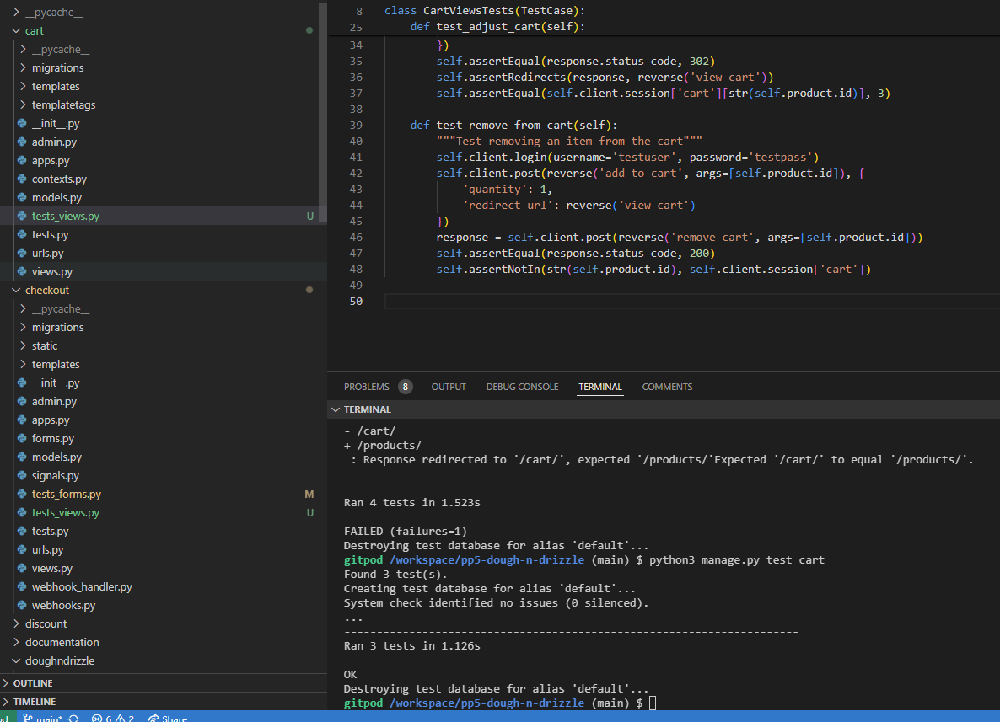
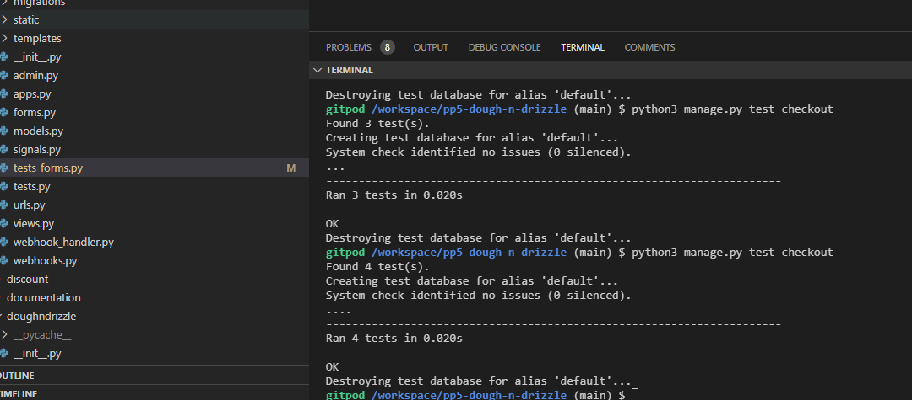
 documentation for the comment on errors.
## Python Validation

In Python, validation is a crucial process to ensure that data inputs and operations conform to expected formats and rules, helping to maintain data integrity and application stability. Results can be found [HERE](documentation/pep8-validation)

## Lighthouse

### Desktop
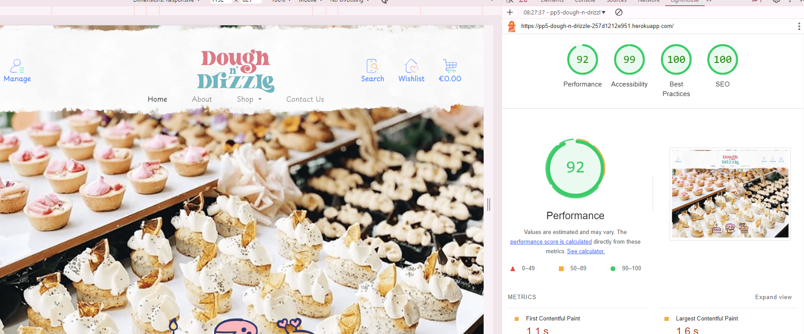
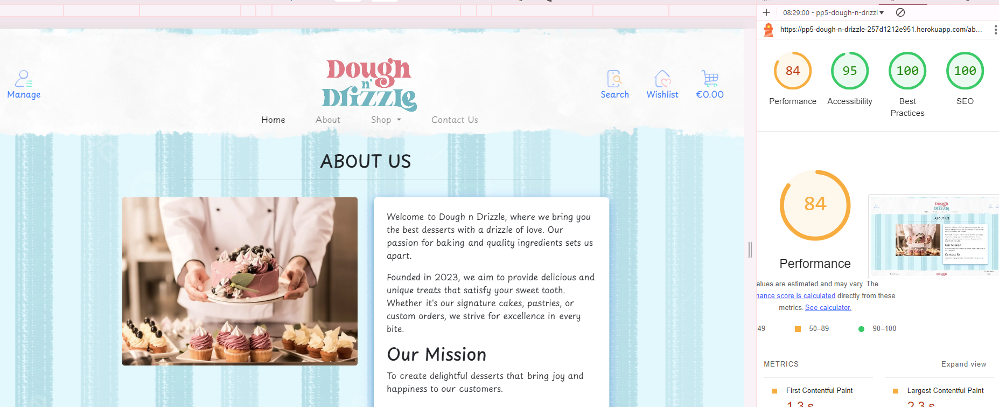
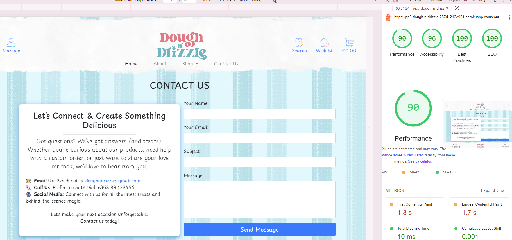
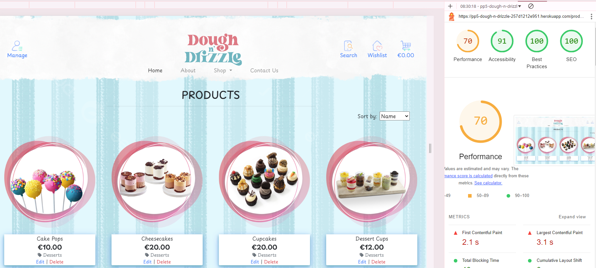

### Mobile
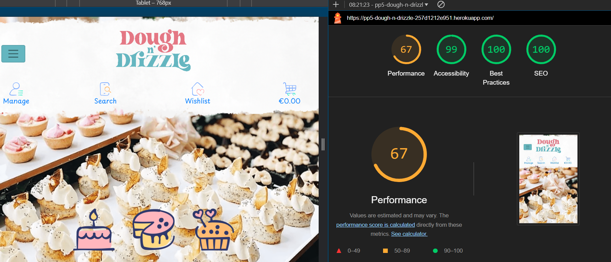
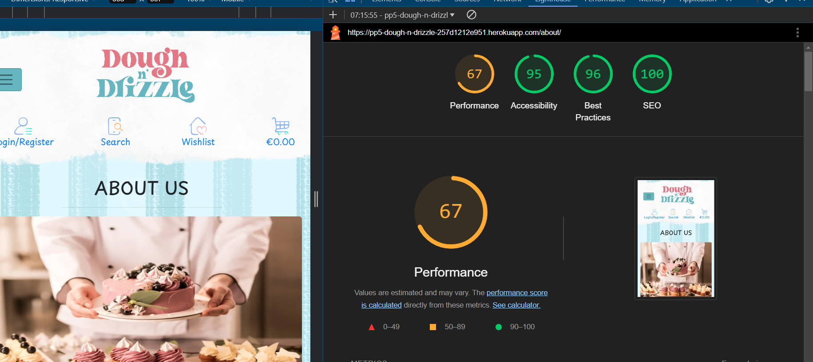
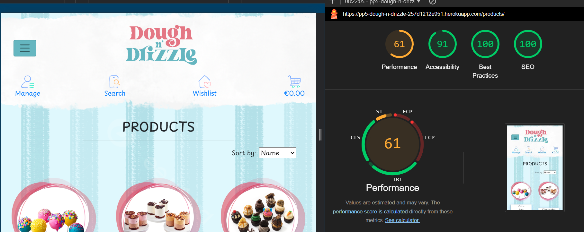
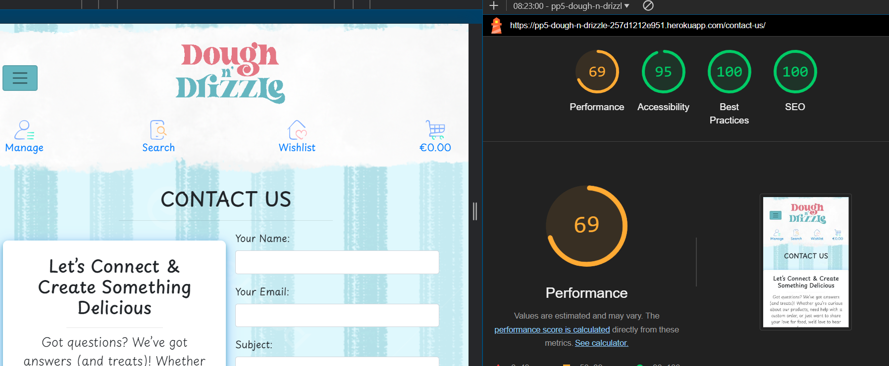

## CSS Validation

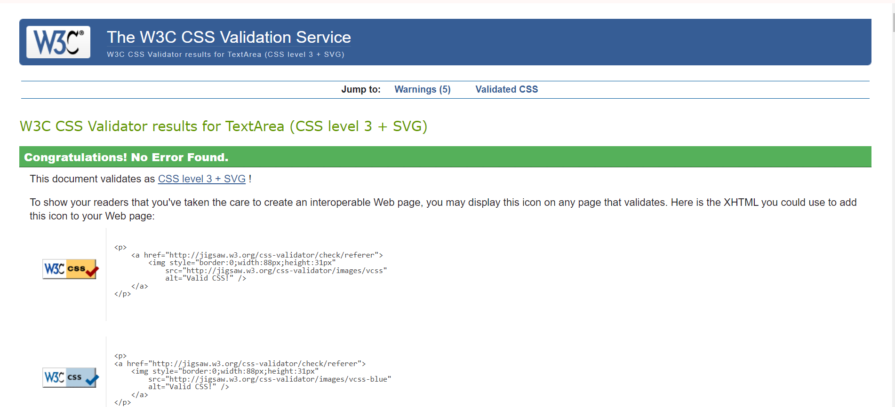 

## **HTML Validation**
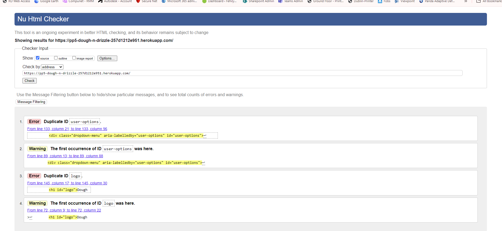

## **JSHint for Javascript**

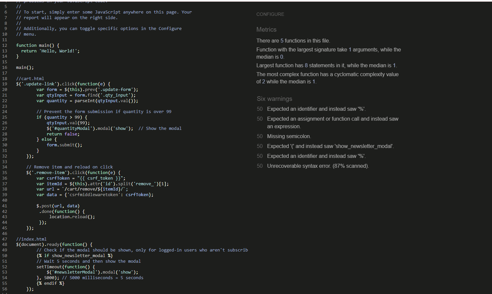
# Other Testing

## Compatibility Testing – different devices

-   Desktop Computers: Testing was conducted across various screen sizes and resolutions to ensure that the application’s layout and functionality remain intact on standard desktop monitors.
-   Laptops: Compatibility testing included different operating systems (Windows, macOS) and resolutions to verify that the user interface adapts appropriately.
-   Tablets: The application was tested on various tablets, including both Android and iOS devices, to ensure touch interactions and screen orientation adjustments function as expected.
-   Mobile: Testing on multiple smartphones ensured that the application is fully responsive, providing an optimal user experience on various Android and iOS devices with different screen sizes and resolutions.

## Cross-browser Testing

Cross-browser testing ensures that Dough n Drizzle functions consistently and correctly across different web browsers. Given the variety of browsers used by individuals, it is vital to verify that the application delivers a uniform user experience regardless of the browser or its version.

## Browsers Tested:

-   Google Chrome: As one of the most widely used browsers, compatibility testing was performed on various versions of Chrome to ensure full functionality and correct display.
-   Mozilla Firefox: Testing included different versions of Firefox to confirm that the application maintains its integrity and performance.
-   Microsoft Edge: Both the legacy version and the newer Chromium-based version of Edge were tested to verify compatibility and consistency.
-   Safari: The application was tested on Safari, particularly focusing on macOS and iOS versions to ensure proper functionality and appearance on Apple devices.
